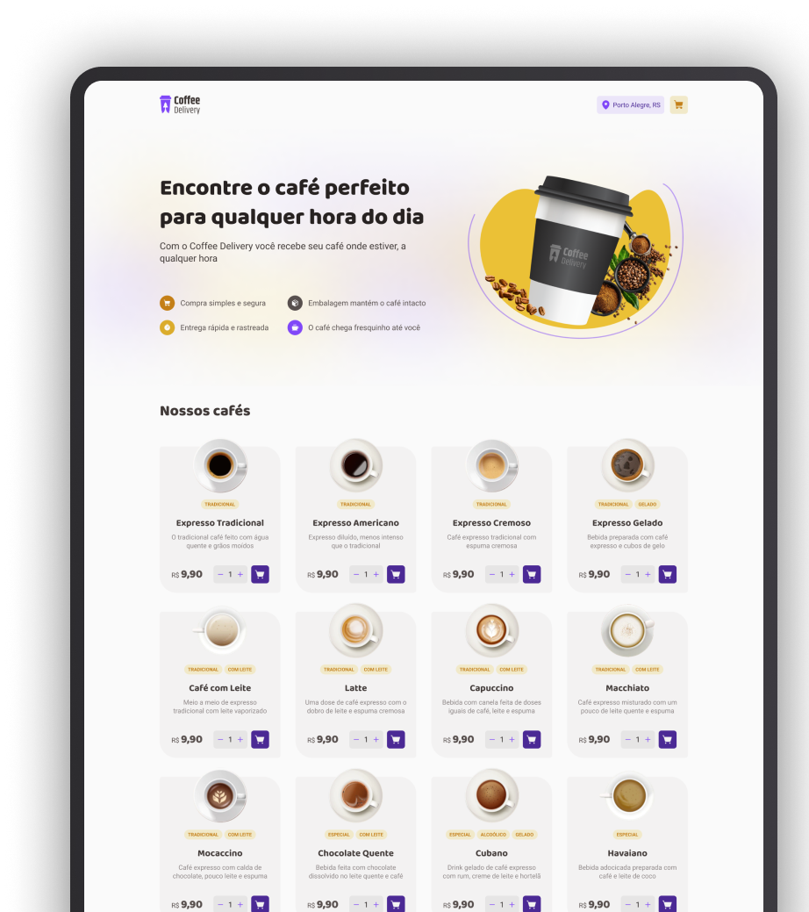

<h2 align="center">
  
</h2>

<p align="center">
  <a href="mailto:bortolettohenrique@gmail.com" target="_blank">
    
  </a>
  <a href="https://www.linkedin.com/in/henriquebortoletto/" target="_blank">
    
  </a>
</p>

---

### Pojeto Carrinho de Compras

Aplicação de gerenciamento de um carrinho de compras, simulando experiência de e-commerce, com as seguintes funcionalidades:

- [x] Listagem de produtos (cafés) disponíveis para compra;
- [x] Aumentar ou remover a quantidade de itens no carrinho;
- [x] Exibir o total de itens no carrinho no Header;
- [x] Deletar um ou mais produto do carrinho no carrinho;
- [x] Exibir o valor total da soma de itens no carrinho multiplicados pelo valor;
- [x] Formulário para o usuário preencher o seu endereço;
  - [x] Validar os campos e submeter o formulário;
  - [x] Caso o formulário seja inválido, exibir uma mensagem de erro;
  - [x] Nao deixar submeter o formulário caso o endereço esteja vazio;
  - [x] Nao deixar submeter o formulário caso o carrinho esteja vazio;
  - [x] Validar opcoes de pagamento;
- [x] Adicionar pagina 404 not found;

---

### Conceitos

Conceitos aplicados no projeto:

- [x] `Componentização`
- [x] `Listas e chaves`
- [x] `Propriedades`
- [x] `Estados`
- [x] `Imutabilidade do estado`
- [x] `Lazy initialization`
- [x] `Efeitos colaterais (Side Effects)`
- [x] `Componentes controlados x não controlado`
- [x] `ContextAPI`
- [x] `useReducer`
- [x] `Componentização de actions e reducers`
- [x] `Gerenciamento de estado com immer`
- [x] `LocalStorage`

---

### Instalação

```bash
  # Clonar o repositório
  $ git clone

  # Entrar no diretório
  $ cd <pasta-do-projeto>

  # Instalar as dependências
  $ yarn ou npm install

  # Iniciar o projeto
  $ yarn dev ou npm run dev
```

---
